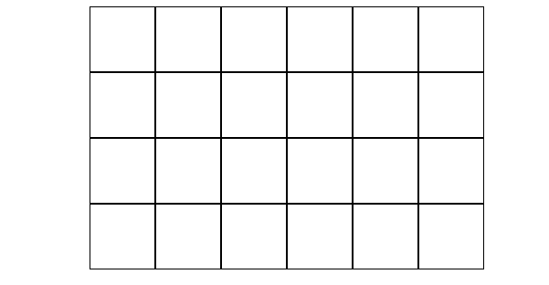

# Jeu

Aujourd'hui nous allons créer un jeu.
Objectif: déplacer un "personnage" d'un point A à un point B en javascript 🤯🥳

---

## Le code fourni

- une feuille css.
- un fichier js.
- un fichier HTML qui inclue les deux autres (css et js).

Et c'est tout !

## Préparer le terrain

Commençons par créer une `div` dans le HTML (pas forcément en javascript). Donnons lui l'id `board`, mais on ne met rien dedans.

Ensuite on s'attaque au JavaScript, on va tout mettre dans la class `app`. On va devoir créer tout ça :

- une variable pour le joueur. Ce doit être un objet qui contient :
  - `x` et `y`, pour gérer la position du joueur sur la grille (par défaut : 0,0).
  - `direction` (par défaut : `'right'`).
- une variable `targetCell`, qui correspond à la case à atteindre. Elle contient les propiétés `x` qui vaut 5 et `y` qui vaut 3.

## Dessinons !

On ajoute une méthode `drawBoard` dans notre class `app`. Cette méthode doit créer des `div` et les ajouter au DOM pour arriver au résultat suivant :

- la div `board` doit contenir 4 divs ayant la classe `row`.
- chaque div `row` doit contenir 6 divs ayant la classe `cell`.

<details>
<summary>Indice</summary>

Il faut une boucle dans une boucle !

</details>

On appelle cette méthode depuis le constructor, pour dessiner la grille dès le chargement de la page !

Ensuite, on fait un peu de CSS, pour arriver au rendu suivant (les cases font 70px de côté):



## Rajouter le joueur et la case d'arrivée

Toujours dans la méthode `drawBoard`, lors de la création des cases, on rajoute une série de test :

- Si la case courante a les mêmes coordonnées (`x` ET `y`) que la variable `targetCell`, on ajoute la classe CSS `targetCell` à la case. Cette classe CSS est a créer pour que la case soit verte.
- Si la case courante a les mêmes coordonnées (`x` ET `y`) que la variable qui correspond au joueur, alors on ajoute une div avec la class `player` DANS la case courante. Le code css de cette classe `player` est déjà fourni.

## Prévoir un reset

On ajoute une nouvelle méthode `clearBoard` dans `app`. Cette méthode doit vider le contenu de la div ayant l'id `board`.

On ajoute aussi une méthode `redrawBoard`, qui appelle `clearBoard` puis `drawBoard`.

## On test !

Dans la console, on peut déjà faire bouger notre personnage ! Essayons :

```js
app.player.x = 1; // on change la position du personnage
app.redrawBoard(); // on met à jour l'affichage !
```

Si ça marche c'est génial ! 🎉

## Pause ?

Bon, c'est déjà vraiment bien tout ça ! Prend une pause, respire, tu peux tu féliciter d'avoir réussi.

Si t'as encore de l'énergie, et qu'il est pas trop tard, tu peux te lancer dans la suite de ce challenge !

## Gérer la rotation du joueur

Ajoutons méthodes `turnLeft` , `turnRight`, `turnDown` et `turnUp` dans la class `app`. Ces méthodes changent la propriété `direction` du joueur, en fonction de sa position courante. Cette direction peut prendre les valeurs "right", "left", "up" et "down".

Par exemple:

```js
console.log(app.player.direction); // => "right"

app.turnLeft();
console.log(app.player.direction); // => "left"

app.turnUp();
console.log(app.player.direction); // => "up"

app.turnDown();
console.log(app.player.direction); // => "down"

app.turnRight();
console.log(app.player.direction); // => "right"
```

Ensuite, il faut modifier le code pour que cette propritété ait une influence visuelle.

<details>
<summary>Indices</summary>

- Dans `drawBoard`, ajouter une classe CSS à la div `player` en fonction de la propriété `direction`.
- Implémenter ces classes CSS en utilisant la propriété `transform: rotate(...)`.
</details>

## Marche Avant

Ajoutons une méthode `moveForward` dans la class `app`. Cette fonction modifie les coordonées du joueur pour le faire avancer dans la direction vers laquelle il est tourné.

Attention : le joueur ne doit pas pouvoir sortir de la grille !

## Auto-redraw

Les méthodes `turnLeft`, `turnRight` et `moveForward` doivent toutes appeler `redrawBoard` en dernière instruction.

## Avec des touches, c'est mieux.

On ajoute une méthode `listenKeyboardEvents` à notre class `app`. Cette méthode ajoute un "event listener" sur l'objet `document`.

Ce listener écoute les évènement `keyup`. En fonction des propriétés de l'event, on lancera les méthodes `turnLeft`, `turnRight`, ou `moveForward`.

On oublie pas d'appeler `listenKeyboardEvents` depuis le constructor pour créer le "listener" dès que la page est chargée.

<details>
<summary>Indice</summary>

Il faut tester `event.keyCode`, et trouver à quel code correspondent les flèches directionnelles.

</details>

## Game Over !

Pour finir, on va implémenter le fonctionnement de la fin de partie :

- Ajoutons une propriété `gameOver` (par défaut : false) à `app`.
- Modifions `turnLeft`, `turnRight`, `turnUp`, `turnDown` et `moveForward` : si `gameOver` est égal à `true`, ces méthodes ne doivent rien faire du tout !
- Implémentons une méthode `isGameOver` dans `app`. Cette méthode teste si le joueur est sur la bonne case. Si c'est le cas, on affiche un message et on change la valeur de `gameOver` à true.
- La méthode `drawBoard` doit appeller `isGameOver` en dernière instruction. Ainsi à chaque fois qu'on redessine la grille, on vérifie si la partie est finie.

🎉

<details>
<summary>Bonus <strong>facultatif</strong></summary>

Ajouter un système pour compter le nombre de déplacements (attention : une rotation EST un déplacement 😏). Afficher ce compteur dans le message de fin de partie.

<details>
<summary>Bonus <strong>encore plus facultatif</strong></summary>

Modifier le CSS pour utiliser l'image `sprite.png` fournie et rendre le joueur plus beau, tout en tenant compte de son orientation !

</details>

</details>
